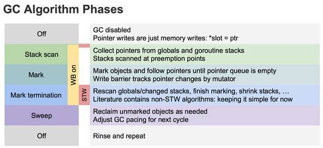

## GC算法

### 引用计数

#### 算法思想

​		每个单元维护一个域，保存其它单元指向它的引用数量（类似有向图的入度）。当引用数量为 0 时，将其回收。

​		引用计数是渐进式的，能够将内存管理的开销分布到整个程序之中。C++ 的 share_ptr 使用的就是引用计算方法。
​		引用计数算法实现一般是把所有的单元放在一个单元池里，比如类似 free list。这样所有的单元就被串起来进行引用计数了。新分配的单元计数值被设置为 1，每次有一个指针被设为指向该单元时，该单元的计数值加 1；而每次删除某个指向它的指针时，它的计数值减 1。当其引用计数为 0 的时候，该单元会被进行回收。

#### 优点

- 渐进式：内存管理与用户程序的执行交织在一起，将 GC 的代价分散到整个程序。不像标记-清扫算法需要 STW (Stop The World，GC 的时候挂起用户程序)
- 算法易于实现
- 内存单元能够很快被回收。相比于其他垃圾回收算法，堆被耗尽或者达到某个阈值才会进行垃圾回收

#### 缺点

- 原始的引用计数不能处理**循环引用**。（针对这个问题，也有很多解决方案，比如强引用等）
- 维护引用计数降低运行效率。内存单元的更新删除等都需要维护相关的内存单元的引用计数，相比于一些追踪式的垃圾回收算法并不需要这些代价。
- 单元池 free list 实现的话不是 cache-friendly 的，这样会导致频繁的 cache miss，降低程序运行效率。

### 标记-清除

​		内存单元并不会在变成垃圾立刻回收，而是**保持不可达状态**，直到**到达某个阈值或者固定时间长度时系统会挂起用户程序**，也就是 **STW**，转而执行垃圾回收程序。垃圾回收程序对所有的存活单元进行一次全局遍历确定哪些单元可以回收。

​		算法分两个部分：**标记（mark）**和**清扫（sweep）**。

​		标记阶段表明所有的存活单元，清扫阶段将垃圾单元回收。

#### 三色标记算法

**三色标记算法**是对标记阶段的改进，原理如下：

1. 起初所有对象都是**白色**。
2. 从根出发扫描所有可达对象，标记为**灰色**，放入待处理队列。
3. 从队列取出灰色对象，将其引用对象标记为灰色放入队列，自身标记为**黑色**，并放入黑色集合中。
4. 重复 3，直到灰色对象队列为空。此时白色对象即为垃圾，进行回收。


**三色标记算法能够让用户程序和 mark 并发的进行**

#### 优点

- 避免了引用计数算法的缺点（不能处理循环引用，需要维护指针）

#### 缺点

- 清除阶段需要 STW

### 节点复制

​		也叫标记-转移。其将整个堆等分为**两个半区（semi-space）**，一个包含现有数据，另一个包含已被废弃的数据。节点复制式垃圾收集从切换两个半区的角色开始，然后收集器在老的半区（也就是 Fromspace）中遍历存活的数据结构，在第一次访问某个单元时把它复制到新半区（也就是Tospace）中去。在 Fromspace 中所有存活单元都被访问过之后，收集器在 Tospace 中建立一个存活数据结构的副本，用户程序可以重新开始运行了。

#### **优点**

- 所有存活的数据结构都缩并地排列在 Tospace 的底部，这样就**不会存在内存碎片**的问题。
- 获取新内存可以简单地通过递增自由空间指针来实现。

#### **缺点**

- 内存得不到充分利用，总有一半的内存空间处于浪费状态。

### 分代收集

​		基于追踪的垃圾回收算法（**标记-清扫**、**节点复制**）的一个主要问题是在生命周期较长的对象上浪费时间（**长生命周期的对象是不需要频繁扫描的**）。同时，内存分配存在这么一个事实 “**most object die young**”。基于这两点，分代垃圾回收算法将对象按生命周期长短存放到堆上的两个（或者更多）区域，这些区域就是分代（generation）。对于新生代的区域的垃圾回收频率要明显高于老年代区域。分配对象的时候从新生代里面分配，如果后面发现对象的生命周期较长，则将其移到老年代，这个过程叫做 promote。随着不断promote，最后新生代的大小在整个堆的占用比例不会特别大。收集的时候集中主要精力在新生代就会相对来说效率更高，STW 时间也会更短。

#### **优点**

- 性能更优

#### **缺点**

- 实现复杂

## Golang GC

### 触发时机

#### 主动触发

主动垃圾回收，通过调用 runtime.GC()

```go
// GC runs a garbage collection and blocks the caller until the
// garbage collection is complete. It may also block the entire program
func GC() {
    ...
    gcStart(gcForceBlockMode, false)
    ...
}
```

#### 被动触发

分配大于 32K 对象时检查触发条件

```go
func mallocgc(size uintptr, typ *_type, needzero bool) unsafe.Pointer {
    ...
    shouldhelpgc := false
    // 分配的对象小于 32K byte
    if size <= maxSmallSize {
        ...
    } else {
        shouldhelpgc = true
        ...
    }
    ...    
    // gcShouldStart() 函数进行触发条件检测
    if shouldhelpgc && gcShouldStart(false) {       
        // gcStart() 函数进行垃圾回收
        gcStart(gcBackgroundMode, false)
    }
}
```

触发条件：

```go
 forceTrigger || memstats.heap_live >= memstats.gc_trigger
```

forceTrigger 是 forceGC 的标志；后面条件是当前堆上的活跃对象大于初始化时候设置的 GC 触发阈值。在 malloc 以及 free 的时候 heap_live 会一直进行更新。

### GC流程

#### 三色标记



1. 所有对象最开始都是白色。

2. 从 root 开始找到所有可达对象，标记为灰色，放入待处理队列。

	> root 包括全局指针和 goroutine 栈上的指针

3. 遍历灰色对象队列，将其引用对象标记为灰色放入待处理队列，自身标记为黑色。

	> re-scan 全局指针和栈。因为 mark 和用户程序是并行的，所以在mark的时候可能会有新的对象分配，这个时候就需要通过**写屏障**（write barrier）记录下来。re-scan 再完成检查一下

4. 循环步骤3直到灰色队列为空为止，此时所有引用对象都被标记为黑色，所有不可达的对象依然为白色，白色的就是需要进行回收的对象。

**STW(Stop The World)**有两个过程：

- 第一个是 GC 将要开始的时候，这个时候主要是一些准备工作，比如 enable write barrier。
- 第二个过程就是上面提到的 re-scan 过程。如果这个时候没有 stw，那么 mark 将无休止。

#### 写屏障 

垃圾回收中的 write barrier 可以理解为编译器**在写操作时特意插入的一段代码**，对应的还有读屏障（read barrier）。
对于和用户程序并发运行的垃圾回收算法，用户程序会一直修改内存，所以需要记录下来。

**为什么需要写屏障？**

写屏障是一个在并发垃圾回收器中才会出现的概念，垃圾回收器的正确性体现在：**不应出现对象的丢失，也不应错误的回收还不需要回收的对象。**

当以下两个条件同时满足时会破坏垃圾回收器的正确性：

- **条件 1**: 赋值器修改对象图，导致某一黑色对象引用白色对象；

- **条件 2**: 从灰色对象出发，到达白色对象的、未经访问过的路径被赋值器破坏。

	> 例如，扫描过程中，复制器使黑色对象 A->B （B现在是白色，但察觉不到被 A 引用）， 同时灰色对象 C 原本引用了 B，但是复制器修改了C 的引用，导致认为 B 没有被引用，将会清除 B

只要能够避免其中任何一个条件，则不会出现对象丢失的情况，因为：

- 如果**条件 1** 被避免，则所有白色对象均被灰色对象引用，没有白色对象会被遗漏；
- 如果**条件 2** 被避免，即便白色对象的指针被写入到黑色对象中，但从灰色对象出发，总存在一条没有访问过的路径，从而找到到达白色对象的路径，白色对象最终不会被遗漏。

Go 中的写屏障其实是指赋值器的写屏障，**赋值器的写屏障作为一种同步机制，使赋值器在进行指针写操作时，能够“通知”回收器，进而不会破坏弱三色不变性**。

[什么是写屏障、混合写屏障，如何实现](https://www.bookstack.cn/read/qcrao-Go-Questions/spilt.9.GC-GC.md)

#### 清除

