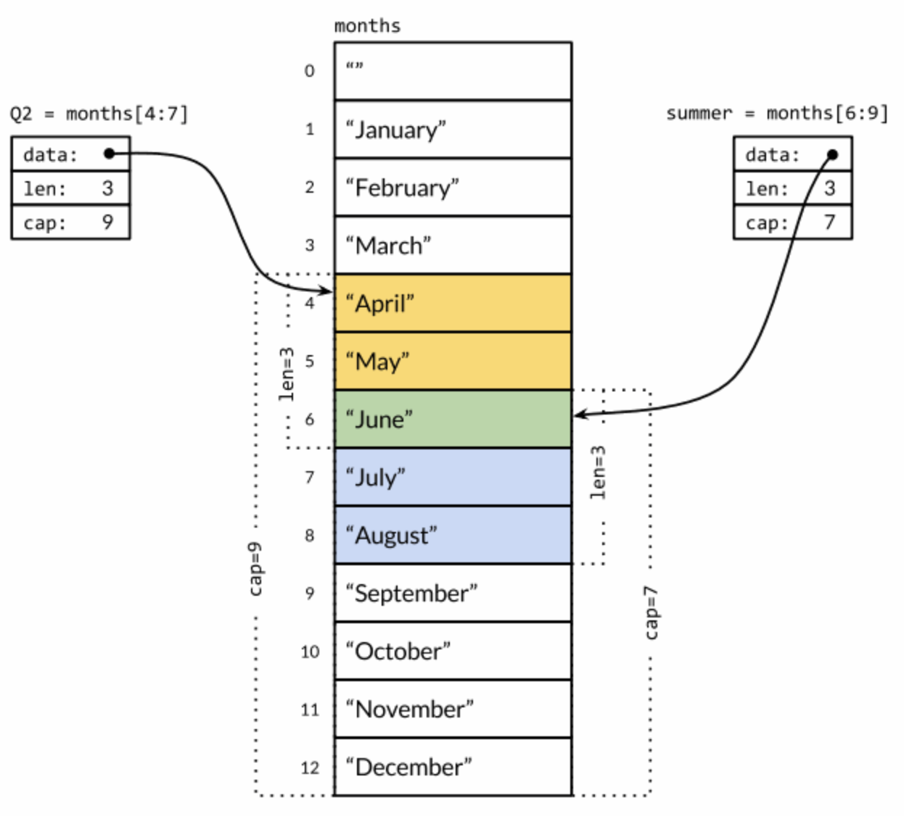
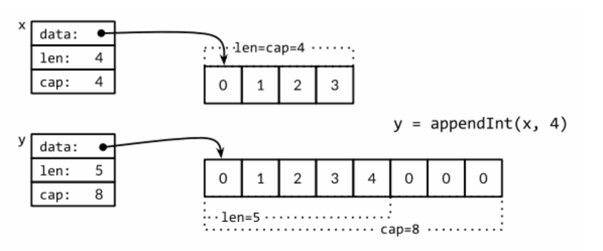

# 环境相关

# 变量与数据结构

## 变量声明

### 显示声明

```go
// var 变量名 类型
var str string
```

- 初始化为零值
- 接口、引用类型（slice、指针、map、chan、func）初始值为 `nil`

### 推导

- 初始化表达式

```go
// var 变量名 = 表达式
var b, f, s = true, 2.3, "four" // bool, float64, string
```

- `:=`推导

```go
// 变量名 := 表达式
i := 100                  // an int
```

## 值传递

​	当调用一个函数的时候，函数的每个调用参数将会被赋值给函数内部的参数变量，所以**函数参数变量接收的是一个复制的副本，并不是原始调用的变量**。因为函数参数传递的机制导致传递大的数组类型将是低效的，并且对数组参数的任何的修改都是发生在复制的数组上，并不能直接修改调用时原始的数组变量。在这个方面，Go语言对待数组的方式和其它很多编程语言不同，其它编程语言可能会隐式地将数组作为引用或指针对象传入被调用的函数，Go 中需要显示传入指针。

```go
func zero(ptr *[32]byte) {
    for i := range ptr {
        ptr[i] = 0
    }
}
```


## Go数据类型

### 基本数据类型

#### 整型

- Go提供了有符号和无符号类型的整数运算。有int8、int16、int32和int64四种截然不同大小的有符号整数类型，分别对应8、16、32、64bit大小的有符号整数，与此对应的是uint8、uint16、uint32和uint64四种无符号整数类型
- 还有两种一般对应特定CPU平台机器字大小的有符号和无符号整数int和uint；其中int是应用最广泛的数值类型。这两种类型都有同样的大小，32或64bit，**但是不能对此做任何的假设；因为不同的编译器即使在相同的硬件平台上可能产生不同的大小**
- `byte`也是`uint8`类型的等价类型，byte类型一般用于强调数值是一个原始的数据而不是一个小的整数
- 无符号的整数类型uintptr，没有指定具体的bit大小但是足以容纳指针

#### 浮点数

- Go提供了两种精度的浮点数，float32和float64,它们的算术规范由IEEE754浮点数国际标准定义，该浮点数规范被所有现代的CPU支持
- 一个float32类型的浮点数可以提供大约6个十进制数的精度，而float64则可以提供约15个十进制数的精度；**通常应该优先使用float64类型**，因为float32类型的累计计算误差很容易扩散，并且float32能精确表示的正整数并不是很大（因为float32的有效bit位只有23个，其它的bit位用于指数和符号；当整数大于23bit能表达的范围时，float32的表示将出现误差）：

#### 复数

- Go提供了两种精度的复数类型：complex64和complex128，分别对应float32和float64两种浮点数精度。内置的complex函数用于构建复数，内建的real和imag函数分别返回复数的实部和虚部

	```go
	var x complex128 = complex(1, 2) // 1+2i
	var y complex128 = complex(3, 4) // 3+4i
	fmt.Println(x*y)                 // "(-5+10i)"
	fmt.Println(real(x*y))           // "-5"
	fmt.Println(imag(x*y))           // "10"
	```

	

- 如果一个浮点数面值或一个十进制整数面值后面跟着一个i，例如3.141592i或2i，它将构成一个复数的虚部，复数的实部是0

	```go
	fmt.Println(1i * 1i) // "(-1+0i)", i^2 = -1
	```

#### 布尔型

- 布尔类型的值只有两种：true和false

#### 字符串

- 一个字符串是一个**不可改变**的字节序列。字符串可以包含任意的数据，包括byte值0。文本字符串通常被解释为采用UTF8编码的Unicode码点（rune）序列。

	> **不变性意味着如果两个字符串共享相同的底层数据的话也是安全的，这使得复制任何长度的字符串代价是低廉的**。同样，一个字符串s和对应的子字符串切片s[7:]的操作也可以安全地共享相同的内存，因此字符串切片操作代价也是低廉的。在这两种情况下都没有必要分配新的内存
	>
	> 

- 内置的len函数可以返回一个字符串中的**字节数目**（不是rune字符数目），索引操作s[i]返回第i个字节的字节值，i必须满足`0 ≤ i< len(s)`条件约束。

- 子字符串操作`s[i:j]`基于原始的s字符串的第i个字节开始到第j个字节（并不包含j本身）生成一个新字符串【不管i还是j都可能被忽略，当它们被忽略时将采用0作为开始位置，采用len(s)作为结束的位置】

- `+`操作符将两个字符串连接构造一个新字符串

##### 字符串和 Byte 切片

标准库中有四个包对字符串处理尤为重要：bytes、strings、strconv和unicode包:

- strings包提供了许多如字符串的查询、替换、比较、截断、拆分和合并等功能。
- bytes包也提供了很多类似功能的函数，但是针对和字符串有着相同结构的[]byte类型。因为字符串是只读的，因此逐步构建字符串会导致很多分配和复制。在这种情况下，使用bytes.Buffer类型将会更有效
- strconv包提供了布尔型、整型数、浮点数和对应字符串的相互转换，还提供了双引号转义相关的转换。
- unicode包提供了IsDigit、IsLetter、IsUpper和IsLower等类似功能，用于给字符分类。每个函数有一个单一的rune类型的参数，然后返回一个布尔值。而像ToUpper和ToLower之类的转换函数将用于rune字符的大小写转换。所有的这些函数都是遵循Unicode标准定义的字母、数字等分类规范。strings包也有类似的函数，它们是ToUpper和ToLower，将原始字符串的每个字符都做相应的转换，然后返回新的字符串


一个字符串是包含只读字节的数组，一旦创建，是不可变的。相比之下，一个字节slice的元素则可以自由地修改.字符串和字节slice之间可以相互转换：

```go
s := "abc"
b := []byte(s)
s2 := string(b)
```

#### 常量

- 常量表达式的值在编译期计算，而不是在运行期。每种常量的潜在类型都是基础类型：boolean、string或数字。


### 复合数据类型

#### 数组

- 长度固定，使用 `len` 获得长度
- 索引访问		

```go
var a [3]int             // array of 3 integers
fmt.Println(a[0])        // print the first element
fmt.Println(a[len(a)-1]) // print the last element, a[2]
for i, val := range(a){
  fmt.Println("%d %d", i, val)
}
// 使用字符面值语法初始化
var q [3]int = [3]int{1, 2, 3}
```

- 数组的长度是数组类型的一个组成部分，因此[3]int和[4]int是两种不同的数组类型。数组的长度必须是常量表达式，因为数组的长度需要在编译阶段确定

	```Go
	q := [3]int{1, 2, 3}
	q = [4]int{1, 2, 3, 4} // compile error: cannot assign [4]int to [3]int
	```

	在数组字面值中，如果在数组的长度位置出现的是“...”省略号，则表示数组的长度是根据初始化值的个数来计算

	```go
	q := [...]int{1, 2, 3}
	fmt.Printf("%T\n", q) // "[3]int"
	```

- 如果一个数组的元素类型是可以相互比较的，那么数组类型也是可以相互比较。这时候通过==比较运算符来比较两个数组，只有当两个数组的所有元素都是相等的时候数组才是相等的。不相等比较运算符!=遵循同样的规则
- 虽然通过指针来传递数组参数是高效的，而且也允许在函数内部修改数组的值，但是数组依然是僵化的类型，因为数组的类型包含了僵化的长度信息。上面的zero函数并不能接收指向[16]byte类型数组的指针，而且也没有任何添加或删除数组元素的方法。由于这些原因数组很少用作函数参数，一般使用slice来替代数组。

#### Slice

- 变长序列
- **slice的底层引用一个数组对象**。一个slice由三个部分构成：`指针`、`长度`和`容量`。
	- 指针指向第一个slice元素对应的底层数组元素的地址（slice的第一个元素并不一定就是数组的第一个元素）
	- 长度对应slice中元素的数目；长度不能超过容量
	- 容量一般是从slice的开始位置到底层数据的结尾位置
	- 内置的len和cap函数分别返回slice的长度和容量
- 多个slice之间可以共享底层的数据，并且引用的数组部分区间可能重叠

- slice的切片操作s[i:j]，其中0 ≤ i≤ j≤ cap(s)，用于创建一个新的slice

	

- slice和数组的字面值语法类似，它们都是用花括弧包含一系列的初始化元素，但是对于slice并没有指明序列的长度

- slice之间不能比较，因此不能使用==操作符来判断两个slice是否含有全部相等元素

	- slice唯一合法的比较操作是和nil比较

- make函数创建一个指定元素类型、长度和容量的slice

	```Go
	make([]T, cap)
	make([]T, len, cap) // same as make([]T, cap)[:len]
	```

##### append函数

- 内置的append函数用于向slice追加元素（1 个或多个）

- 扩容

	

	通常我们并不知道append调用是否导致了内存的重新分配，因此也不能确认新的slice和原始的slice是否引用的是相同的底层数组空间。同样，我们不能确认在原先的slice上的操作是否会影响到新的slice。因此，通常是将append返回的结果直接赋值给输入的slice变量

	```go
	runes = append(runes, r)
	```

	

- slice并不是一个纯粹的引用类型，它实际上是一个类似下面结构体的聚合类型

	```Go
	type IntSlice struct {
	    ptr      *int
	    len, cap int
	}
	```

#### Map

- map就是一个**哈希表**的引用，map类型可以写为map[K]V，其中K对应的key必须是支持==比较运算符的数据类型，所以map可以通过测试key是否相等来判断是否已经存在。

- 内置的make函数可以创建一个map

	```Go
	ages := make(map[string]int) // mapping from strings to ints
	Ages := map[string]int{
	    "alice":   31,
	    "charlie": 34,
	}
	```

- 内置的delete函数可以删除元素

	```Go
	delete(ages, "alice") // remove element ages["alice"]
	```

- map中的元素并不是一个变量，因此不能对map的元素进行取址操作，map可能随着元素数量的增长而重新分配更大的内存空间，从而可能导致之前的地址无效

- 使用range风格的for循环实现对 map 的遍历操作

- 通过key作为索引下标来访问map将产生一个value。如果key在map中是存在的，那么将得到与key对应的value；如果key不存在，那么将得到value对应类型的零值

	```Go
	if age, ok := ages["bob"]; !ok { /* ... */ }
	```

#### Struct

#### JSON

encoding/json包对 json 格式的数据编码、解码有良好的支持

### 接口

# 高级特性

## Goroutines 和 Channels

### Goroutines

在Go语言中，每一个并发的执行单元叫作一个goroutine（协程）

当一个程序启动时，其主函数即在一个单独的goroutine中运行，叫做main goroutine

### channels

- channels是goruntines之间的通信机制。一个channel是一个通信机制，它可以让一个goroutine通过它给另一个goroutine发送值信息。每个channel都有一个特殊的类型，也就是channels可发送数据的类型。

- 使用内置的make函数创建一个channel

	```go
	ch = make(chan int)    // unbuffered channel
	ch = make(chan int, 0) // unbuffered channel
	ch = make(chan int, 3) // buffered channel with capacity 3
	```

- channel也对应一个make创建的底层数据结构的引用。当复制一个channel或用于函数参数传递时，**只是拷贝了一个channel引用**，因此调用者和被调用者将引用同一个channel对象。和其它的引用类型一样，channel的零值也是nil。两个相同类型的channel可以使用==运算符比较。如果两个channel引用的是相同的对象，那么比较的结果为真。一个channel也可以和nil进行比较。

- close操作，用于关闭channel，随后对基于该channel的任何发送操作都将导致panic异常。对一个已经被close过的channel进行接收操作依然可以接受到之前已经成功发送的数据；如果channel中已经没有数据的话将产生一个零值的数据。

	- 重复关闭channel 或者关闭一个 nil 值的 channel 将会引发 panic

#### 单方向 channel

- Go语言的类型系统提供了单方向的channel类型，分别用于只发送或只接收的channel。这种限制将在编译期检测。
	- `chan<- int`表示一个只发送int的channel，只能发送不能接收。
	- `<-chan int`表示一个只接收int的channel，只能接收不能发送
- 关闭操作只用于断言不再向channel发送新的数据，所以只有在发送者所在的goroutine才会调用close函数，因此对一个只接收的channel调用close将是一个编译错误

#### 无缓存 channel

- **一个基于无缓存Channels的发送操作将导致发送者goroutine阻塞**，**直到另一个goroutine在相同的Channels上执行接收操作**，当发送的值通过Channels成功传输之后，两个goroutine可以继续执行后面的语句。反之，**如果接收操作先发生，那么接收者goroutine也将阻塞，直到有另一个goroutine在相同的Channels上执行发送操作**。
- 基于无缓存Channels的发送和接收操作将导致两个goroutine做一次同步操作。因为这个原因，无缓存Channels有时候也被称为**同步Channels**。当通过一个无缓存Channels发送数据时，接收者收到数据发生在再次唤醒唤醒发送者goroutine之前（**happens before**）

#### 带缓存的 channel

- 向缓存Channel的发送操作就是向内部缓存队列的尾部插入元素，接收操作则是从队列的头部删除元素。如果内部缓存队列是满的，那么发送操作将阻塞直到因另一个goroutine执行接收操作而释放了新的队列空间。相反，如果channel是空的，接收操作将阻塞直到有另一个goroutine执行发送操作而向队列插入元素
- cap 可以获取 channel 的容量，len 可以获取当前 channel 的有效元素个数

#### channel 泄露

```go
func main() {
    abort := make(chan struct{})
		go func() {
    		os.Stdin.Read(make([]byte, 1)) // read a single byte
    		abort <- struct{}{}
		}()
  
    fmt.Println("Commencing countdown.  Press return to abort.")
    tick := time.Tick(1 * time.Second)
    for countdown := 10; countdown > 0; countdown-- {
        fmt.Println(countdown)
        select {
        case <-tick:
            // Do nothing.
        case <-abort:
            fmt.Println("Launch aborted!")
            return
        }
    }
    launch()
}
```

time.Tick函数表现得好像它创建了一个在循环中调用time.Sleep的goroutine，每次被唤醒时发送一个事件。当countdown函数返回时，select会停止从tick中接收事件，但是ticker这个goroutine还依然存活，继续徒劳地尝试向channel中发送值，然而这时候已经没有其它的goroutine会从该channel中接收值了——这被称为goroutine泄露.

```go
ticker.Stop() // cause the ticker's goroutine to terminate
```

## Select 多路复用

```go
select {
case <-ch1:
    // ...
case x := <-ch2:
    // ...use x...
case ch3 <- y:
    // ...
default:
    // ...
}
```

- 每一个case代表一个通信操作（在某个channel上进行发送或者接收），并且会包含一些语句组成的一个语句块。
- 多个case同时就绪时，select会随机地选择一个执行，这样来保证每一个channel都有平等的被select的机会
- 有时候我们希望能够从channel中发送或者接收值，并避免因为发送或者接收导致的阻塞，尤其是当channel没有准备好写或者读时。使用`default`来设置当其它的操作都不能够马上被处理时程序需要执行哪些逻辑。

## 基于共享变量的并发

### sync.Mutex

#### 通过容量为 1 的 channel 实现互斥锁

通过使用容量为 n 的buffered channel作为一个计数信号量，来保证最多只有n个goroutine会同时执行。同理，可以用一个容量只有1的channel来保证最多只有一个goroutine在同一时刻访问一个共享变量:

```go
var (
    sema    = make(chan struct{}, 1) // a binary semaphore guarding balance
    balance int
)

func Deposit(amount int) {
    sema <- struct{}{} // acquire token
    balance = balance + amount
    <-sema // release token
}

func Balance() int {
    sema <- struct{}{} // acquire token
    b := balance
    <-sema // release token
    return b
}
```

#### mutex

```go
import "sync"

var (
    mu      sync.Mutex // guards balance
    balance int
)

func Deposit(amount int) {
    mu.Lock()
    balance = balance + amount
    mu.Unlock()
}

func Balance() int {
    mu.Lock()
    b := balance
    mu.Unlock()
    return b
}
```

#### 不可重入

```go
// NOTE: incorrect!
func Withdraw(amount int) bool {
    mu.Lock()	// 申请锁
    defer mu.Unlock()
    Deposit(-amount)
    if Balance() < 0 {
        Deposit(amount)	// Deposit 再次申请锁
        return false // insufficient funds
    }
    return true
}
```

上面例子中，Deposit会调用mu.Lock()第二次去获取互斥锁，但因为mutex已经锁上了，而无法被重入（go里没有重入锁）——也就是说没法对一个已经锁上的mutex来再次上锁——这会导致程序死锁，没法继续执行下去，Withdraw会永远阻塞下去。

> 关于Go的mutex不能重入这一点有很充分的理由：mutex的目的是**确保共享变量在程序执行时的关键点上能够保证不变性**。
>
> 不变性的一层含义是“没有goroutine访问共享变量”，但实际上这里对于mutex保护的变量来说，不变性还包含更深层含义：当一个goroutine获得了一个互斥锁时，它能断定被互斥锁保护的变量正处于不变状态（即没有其他代码块正在读写共享变量），在其获取并保持锁期间，可能会去更新共享变量，这样不变性只是短暂地被破坏，然而当其释放锁之后，锁必须保证共享变量重获不变性并且多个goroutine按顺序访问共享变量。**尽管一个可以重入的mutex也可以保证没有其它的goroutine在访问共享变量，但它不具备不变性更深层含义**

一个通用的解决方案是将一个函数分离为多个函数，比如把Deposit分离成两个：一个不导出的函数deposit，这个函数假设锁总是会被保持并去做实际的操作（不用申请锁），另一个是导出的函数Deposit，这个函数会调用deposit，但在调用前会先去获取锁

### sync.RWMutex

由于Balance函数只需要读取变量的状态，所以同时让多个Balance调用并发运行事实上是安全的，只要在运行的时候没有存款或者取款操作就行。在这种场景下需要一种特殊类型的锁，其允许多个只读操作并行执行，但写操作会完全互斥。Go语言提供的这样的锁是sync.RWMutex

```go
var mu sync.RWMutex
var balance int
func Balance() int {
    mu.RLock() // readers lock
    defer mu.RUnlock()
    return balance
}
```

### sync.Once 惰性初始化

```go
var icons map[string]image.Image

func loadIcons() {
    icons = map[string]image.Image{
        "spades.png":   loadIcon("spades.png"),
        "hearts.png":   loadIcon("hearts.png"),
        "diamonds.png": loadIcon("diamonds.png"),
        "clubs.png":    loadIcon("clubs.png"),
    }
}
```

一个goroutine在检查icons是非空时，并不能就假设这个变量的初始化流程已经走完了

通过引入读写锁来实现在并发条件下对变量进行惰性加载：

```go
var mu sync.RWMutex // guards icons
var icons map[string]image.Image
// Concurrency-safe.
func Icon(name string) image.Image {
    mu.RLock()
    if icons != nil {
        icon := icons[name]
        mu.RUnlock()
        return icon
    }
    mu.RUnlock()

    // acquire an exclusive lock
    mu.Lock()
    if icons == nil { // NOTE: must recheck for nil
        loadIcons()
    }
    icon := icons[name]
    mu.Unlock()
    return icon
}
```

​		上面的模板能够更好的并发，但是有一点太复杂且容易出错。sync包提供了一个专门的方案来解决这种一次性初始化的问题：`sync.Once`。

​		概念上来讲，一次性的初始化需要一个互斥量mutex和一个boolean变量来记录初始化是不是已经完成了；互斥量用来保护boolean变量和客户端数据结构。Do这个唯一的方法需要接收初始化函数作为其参数。

```go
var loadIconsOnce sync.Once
var icons map[string]image.Image
// Concurrency-safe.
func Icon(name string) image.Image {
    loadIconsOnce.Do(loadIcons)
    return icons[name]
}
```

每一次对Do(loadIcons)的调用都会锁定mutex，并会检查boolean变量。在第一次调用时，boolean变量的值是false，Do会调用loadIcons并会将boolean变量设置为true。随后的调用什么都不会做，但是mutex同步会保证loadIcons对内存（就是指icons变量）产生的效果能够对所有goroutine可见。用这种方式来使用sync.Once的话，能够避免在变量被构建完成之前和其它goroutine共享该变量。

